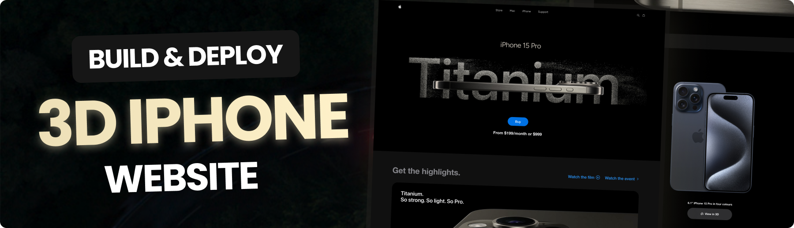

<h1 align="center"><b>📱3D Iphone Website 💻</b></h1>



## 🤖 Introduction

This is a clone of Apple's iPhone 15 Pro website using React.js and TailwindCSS. It highlights the effective use of GSAP (Greensock Animations) and Three.js for displaying iPhone 15 Pro models in various colors and shapes.

If you're getting started and need assistance or face any bugs, please reach me out. 

## ⚙️ Tech Stack

- React.js
- Three.js
- React Three Fiber
- React Three Drei
- GSAP (Greensock)
- Vite
- Tailwind CSS

## 🔋 Key Features

- [x] 📚 **Beautiful Subtle Smooth Animations using GSAP**: Enhanced user experience with seamless and captivating animations powered by GSAP.

- [x] ⚡ **3D Model Rendering with Different Colors and Sizes**: Explore the iPhone 15 Pro from every angle with dynamic 3D rendering, offering various color and size options.

- [x] 📷 **Custom Video Carousel (made with GSAP)**: Engage users with a unique and interactive video carousel developed using GSAP for a personalized browsing experience.

- [x] 🚀 **Completely Responsive**: Consistent access and optimal viewing on any device with a fully responsive design that adapts to different screen sizes.

## 🛠️ How To Use

Follow these steps to set up the project locally on your machine.

**Prerequisites**

Make sure you have the following installed on your machine:

- [Git](https://git-scm.com/)
- [Node.js](https://nodejs.org/en)
- [npm](https://www.npmjs.com/) (Node Package Manager)

**Cloning the Repository**

```bash
git clone https://github.com/Sandhit06/3D-Iphone-Website.git
cd 3D-Iphone-Website
```

**Installation**

Install the project dependencies using npm:

```bash
npm install
```

**Running the Project**

```bash
npm run dev
```

Open [http://localhost:5173](http://localhost:5173) in your browser to view the project. 

## Still need help?
Open an issue on our GitHub repository, and we will help you as soon as possible.

Enjoy exploring and extending this project! Feel free to contribute and suggest improvements.

## Contact

If you want to contact me you can reach me at [Twitter](https://x.com/SandhitK).

## Developer
<table>
    <tr align="center">
        <td>
        Sandhit Karmakar
        <p align="center">
            
        </p>
            <p align="center">
                <a href = "https://github.com/Sandhit06">
                    
                </a>
                <a href = "https://www.linkedin.com/in/sandhit-karmakar/" target="_blank">
                    
                </a>
                <a href = "mailto:sandhitkarmakar@gmail.com" target="_blank">
                    
                </a>
            </p>
        </td>
    </tr>
</table>

<p align="center">
    Made with ❤️ by <a href="https://github.com/Sandhit06">Sandhit Karmakar</a>
</p>
